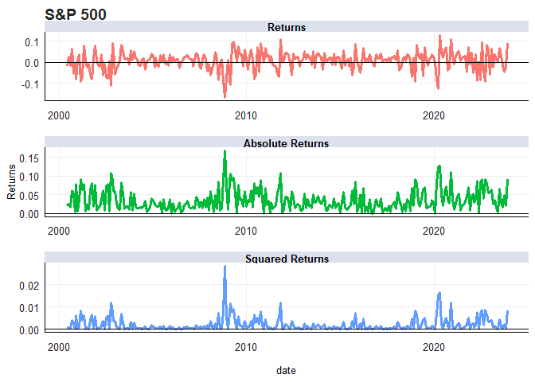
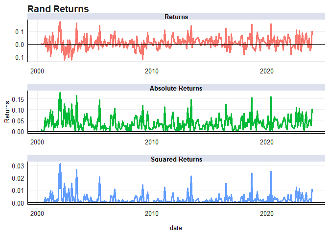
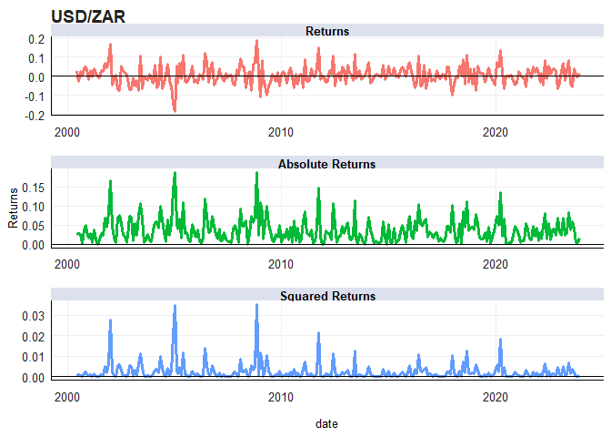

# Purpose

Purpose of this work folder.

Ideally store a minimum working example data set in data folder.

Add binary files in bin, and closed R functions in code. Human Readable
settings files (e.g. csv) should be placed in settings/

``` r
rm(list = ls()) # Clean your environment:
gc() # garbage collection - It can be useful to call gc after a large object has been removed, as this may prompt R to return memory to the operating system.
```

    ##          used (Mb) gc trigger (Mb) max used (Mb)
    ## Ncells 467188 25.0    1004631 53.7   660382 35.3
    ## Vcells 863912  6.6    8388608 64.0  1770661 13.6

``` r
library(tidyverse)
```

    ## Warning: package 'ggplot2' was built under R version 4.3.2

    ## ── Attaching core tidyverse packages ──────────────────────── tidyverse 2.0.0 ──
    ## ✔ dplyr     1.1.3     ✔ readr     2.1.4
    ## ✔ forcats   1.0.0     ✔ stringr   1.5.1
    ## ✔ ggplot2   3.4.4     ✔ tibble    3.2.1
    ## ✔ lubridate 1.9.2     ✔ tidyr     1.3.0
    ## ✔ purrr     1.0.2     
    ## ── Conflicts ────────────────────────────────────────── tidyverse_conflicts() ──
    ## ✖ dplyr::filter() masks stats::filter()
    ## ✖ dplyr::lag()    masks stats::lag()
    ## ℹ Use the conflicted package (<http://conflicted.r-lib.org/>) to force all conflicts to become errors

``` r
library(readxl)
library(fmxdat)
list.files('code/', full.names = T, recursive = T) %>% .[grepl('.R', .)] %>% as.list() %>% walk(~source(.))
```

# Loading and Wrangling

This section deals with loading and wrangling the data into a usable
format.

``` r
global_indices <- readRDS("data/Global_Indices.rds")
local_indices <- readRDS("data/LCL_Indices.rds")
USDZAR <- readRDS("data/USDZAR.rds")

SP <- global_indices %>% #This includes rand returns
    filter(Tickers == "SPXT") %>% 
    select(c(date, Returns, Rand_Returns)) %>% 
    rename(SP500 = Returns)

lcl_index <- "J200" # I create this variable so the choice of SA index can easily be changed
JSE <- local_indices %>% 
    filter(Tickers == lcl_index) %>% 
    select(c(date, Returns)) %>% 
    rename(JSE40 = Returns)

joinedDF <- left_join(SP, JSE, by = 'date')


df <- joinedDF
names <- c("S&P 500", "Rand Returns", "JSE Top 40")


returns_plotter(joinedDF, c("S&P 500", "Rand Returns", "JSE Top 40"))
```

    ## Warning: Using an external vector in selections was deprecated in tidyselect 1.1.0.
    ## ℹ Please use `all_of()` or `any_of()` instead.
    ##   # Was:
    ##   data %>% select(i)
    ## 
    ##   # Now:
    ##   data %>% select(all_of(i))
    ## 
    ## See <https://tidyselect.r-lib.org/reference/faq-external-vector.html>.
    ## This warning is displayed once every 8 hours.
    ## Call `lifecycle::last_lifecycle_warnings()` to see where this warning was
    ## generated.

    ## Warning: Using `size` aesthetic for lines was deprecated in ggplot2 3.4.0.
    ## ℹ Please use `linewidth` instead.
    ## This warning is displayed once every 8 hours.
    ## Call `lifecycle::last_lifecycle_warnings()` to see where this warning was
    ## generated.

    ## $`S&P 500`



    ## 
    ## $`Rand Returns`



    ## 
    ## $`JSE Top 40`



# Stratification

This analysis will first focus on seeing whether the JSE experience
higher volatility when the S&P and the rand experiences higher
volatility. I then investigate whether all variables experienced it
during the GFC and Covid. This follows the practical

``` r
#Winsorizing the data to reduce influence of extreme returns
Idxs <- joinedDF %>% 
    gather(Index, Returns, -date) %>% 
    mutate(Year = format(date, "%Y")) %>% 
    group_by(Index) %>% 
    mutate(Top = quantile(Returns, 0.99), Bot = quantile(Returns, 0.01)) %>% 
    mutate(Returns = ifelse(Returns > Top, Top, 
                         ifelse(Returns < Bot, Bot, Returns))) %>% 
    ungroup()

#Calculate the top quantiles of volatility in the S&P 500
SP_SD <- joinedDF %>% 
    select(c(date, SP500)) %>% 
    mutate(Year = format(date, "%Y")) %>% 
    arrange(date) %>% 
    group_by(Year) %>% 
    summarise(SD = sd(SP500)*sqrt(12))%>% 
    mutate(TopQtile = quantile(SD, 0.75, na.rm = TRUE),
           BotQtile = quantile(SD, 0.25, na.rm = TRUE))

#Extract years in which S&P has high or low volatility
SP_hivol <- SP_SD %>% 
    filter(SD > TopQtile) %>% pull(Year)
SP_lowvol <- SP_SD %>% 
    filter(SD < BotQtile) %>% pull(Year)


Idxs_no_SP <- Idxs %>% filter(Index != "SP500")

Perf_comparisons <- function(df, Ys, Alias){
#This function first calculates the full sample SD for JSE and the Rand
#It then calculates the SD during either high or low volatility periods of S&P
#   and compares with full sample SD
    
    Unconditional_SD <- 
        df %>% 
        group_by(Index) %>% 
        mutate(Full_SD = sd(Returns) * sqrt(12)) %>% 
        filter(Year %in% Ys) %>% 
        summarise(SD = sd(Returns) * sqrt(12), across(.cols = starts_with("Full"), .fns = max)) %>% 
        arrange(desc(SD)) %>% mutate(Period = Alias) %>% 
        group_by(Index) %>% 
        mutate(Ratio = SD / Full_SD)
    
    return(Unconditional_SD)
  
}

#Put results in Kable tables
perf_hi_SP <- Perf_comparisons(Idxs_no_SP, Ys = SP_hivol, Alias = "High_Vol")
kableExtra::kable(perf_hi_SP)
```

<table>
<thead>
<tr>
<th style="text-align:left;">
Index
</th>
<th style="text-align:right;">
SD
</th>
<th style="text-align:right;">
Full_SD
</th>
<th style="text-align:left;">
Period
</th>
<th style="text-align:right;">
Ratio
</th>
</tr>
</thead>
<tbody>
<tr>
<td style="text-align:left;">
JSE40
</td>
<td style="text-align:right;">
0.2299355
</td>
<td style="text-align:right;">
0.1703735
</td>
<td style="text-align:left;">
High_Vol
</td>
<td style="text-align:right;">
1.349596
</td>
</tr>
<tr>
<td style="text-align:left;">
Rand_Returns
</td>
<td style="text-align:right;">
0.2156021
</td>
<td style="text-align:right;">
0.1716540
</td>
<td style="text-align:left;">
High_Vol
</td>
<td style="text-align:right;">
1.256027
</td>
</tr>
</tbody>
</table>

``` r
perf_low_SP <- Perf_comparisons(Idxs_no_SP, Ys = SP_lowvol, Alias = "Low_Vol")
kableExtra::kable(perf_low_SP)
```

<table>
<thead>
<tr>
<th style="text-align:left;">
Index
</th>
<th style="text-align:right;">
SD
</th>
<th style="text-align:right;">
Full_SD
</th>
<th style="text-align:left;">
Period
</th>
<th style="text-align:right;">
Ratio
</th>
</tr>
</thead>
<tbody>
<tr>
<td style="text-align:left;">
Rand_Returns
</td>
<td style="text-align:right;">
0.1527510
</td>
<td style="text-align:right;">
0.1716540
</td>
<td style="text-align:left;">
Low_Vol
</td>
<td style="text-align:right;">
0.8898772
</td>
</tr>
<tr>
<td style="text-align:left;">
JSE40
</td>
<td style="text-align:right;">
0.1385775
</td>
<td style="text-align:right;">
0.1703735
</td>
<td style="text-align:left;">
Low_Vol
</td>
<td style="text-align:right;">
0.8133743
</td>
</tr>
</tbody>
</table>

# ARCH Tests

#GARCH modelling
