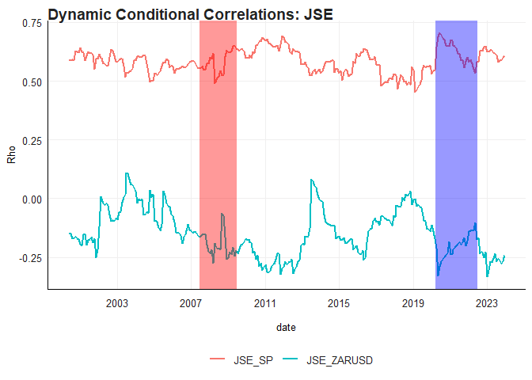

# Purpose

Purpose of this work folder.

Ideally store a minimum working example data set in data folder.

Add binary files in bin, and closed R functions in code. Human Readable
settings files (e.g. csv) should be placed in settings/

``` r
rm(list = ls()) # Clean your environment:
gc() # garbage collection - It can be useful to call gc after a large object has been removed, as this may prompt R to return memory to the operating system.
```

    ##          used (Mb) gc trigger (Mb) max used (Mb)
    ## Ncells 467785 25.0    1006337 53.8   660382 35.3
    ## Vcells 867489  6.7    8388608 64.0  1770696 13.6

``` r
library(tidyverse)
```

    ## ── Attaching core tidyverse packages ──────────────────────── tidyverse 2.0.0 ──
    ## ✔ dplyr     1.1.3     ✔ readr     2.1.4
    ## ✔ forcats   1.0.0     ✔ stringr   1.5.1
    ## ✔ ggplot2   3.4.4     ✔ tibble    3.2.1
    ## ✔ lubridate 1.9.2     ✔ tidyr     1.3.0
    ## ✔ purrr     1.0.2     
    ## ── Conflicts ────────────────────────────────────────── tidyverse_conflicts() ──
    ## ✖ dplyr::filter() masks stats::filter()
    ## ✖ dplyr::lag()    masks stats::lag()
    ## ℹ Use the conflicted package (<http://conflicted.r-lib.org/>) to force all conflicts to become errors

``` r
library(readxl)
library(fmxdat)
library(tseries)
```

    ## Registered S3 method overwritten by 'quantmod':
    ##   method            from
    ##   as.zoo.data.frame zoo

``` r
library(knitr)
library(MTS)
library(zoo)
```

    ## 
    ## Attaching package: 'zoo'
    ## 
    ## The following objects are masked from 'package:base':
    ## 
    ##     as.Date, as.Date.numeric

``` r
library(ggthemes)
library(rmgarch)
```

    ## Loading required package: rugarch
    ## Loading required package: parallel
    ## 
    ## Attaching package: 'rugarch'
    ## 
    ## The following object is masked from 'package:purrr':
    ## 
    ##     reduce
    ## 
    ## The following object is masked from 'package:stats':
    ## 
    ##     sigma
    ## 
    ## 
    ## Attaching package: 'rmgarch'
    ## 
    ## The following objects are masked from 'package:dplyr':
    ## 
    ##     first, last

``` r
library(rugarch)
library(mgarchBEKK)
```

    ## Loading required package: mvtnorm

``` r
list.files('code/', full.names = T, recursive = T) %>% .[grepl('.R', .)] %>% as.list() %>% walk(~source(.))
```

# Loading and Wrangling

This section deals with loading and wrangling the data into a usable
format.

``` r
global_indices <- readRDS("data/Global_Indices.rds")
local_indices <- readRDS("data/LCL_Indices.rds")
USDZAR <- readRDS("data/USDZAR.rds")

SP <- global_indices %>% #This includes rand returns
    filter(Tickers == "SPXT") %>% 
    select(c(date, Returns)) %>% 
    rename(SP500 = Returns)

lcl_index <- "J200" # I create this variable so the choice of SA index can easily be changed
JSE <- local_indices %>% 
    filter(Tickers == lcl_index) %>% 
    select(c(date, Returns)) %>% 
    rename(JSE40 = Returns)

joinedDF <- left_join(SP, JSE, by = 'date')

firstdate <- joinedDF %>%  slice(1) %>% pull(date)

ZARUSD <- USDZAR %>% 
    select(c(date, value)) %>% 
    filter(date >= firstdate) %>% 
    mutate(yearmonth = format(ymd(date), "%Y-%m")) %>% 
    group_by(yearmonth) %>% 
    mutate(ZARUSD = dplyr::last(value)/dplyr::first(value) - 1) %>% 
    filter(date == dplyr::last(date)) %>% 
    ungroup() %>% 
    slice(-1) %>% 
    select(c(date, ZARUSD))

joinedDF <- left_join(ZARUSD, joinedDF, by = 'date') 
joinedDF <- joinedDF[c(1,3,4,2)]

#Plot the returns
returns_plotter(joinedDF, c("S&P 500", "JSE Top 40", "USD/ZAR"))
```

    ## $`S&P 500`


    ## 
    ## $`JSE Top 40`


    ## 
    ## $`USD/ZAR`


# Stratification

This analysis will first focus on seeing whether the JSE experience
higher volatility when the S&P and the rand experiences higher
volatility. I then investigate whether all variables experienced it
during the GFC and Covid. This follows the practical

``` r
#Winsorizing the data to reduce influence of extreme returns
Idxs <- joinedDF %>% 
    gather(Index, Returns, -date) %>% 
    mutate(Year = format(date, "%Y")) %>% 
    group_by(Index) %>% 
    mutate(Top = quantile(Returns, 0.99), Bot = quantile(Returns, 0.01)) %>% 
    mutate(Returns = ifelse(Returns > Top, Top, 
                         ifelse(Returns < Bot, Bot, Returns))) %>% 
    ungroup()

#The analyze_volatility_periods function returns a table for stratification analysis
# of high and low volatility periods for a specific series

results_SP <- analyze_volatility_periods(joinedDF, "SP500", Idxs)
kableExtra::kable(results_SP$HighVol, caption = "S&P 500")
```

<table>
<caption>
S&P 500
</caption>
<thead>
<tr>
<th style="text-align:left;">
Index
</th>
<th style="text-align:right;">
SD
</th>
<th style="text-align:right;">
Full_SD
</th>
<th style="text-align:left;">
Period
</th>
<th style="text-align:right;">
Ratio
</th>
</tr>
</thead>
<tbody>
<tr>
<td style="text-align:left;">
JSE40
</td>
<td style="text-align:right;">
0.2299961
</td>
<td style="text-align:right;">
0.1700823
</td>
<td style="text-align:left;">
High_Vol SP500
</td>
<td style="text-align:right;">
1.352263
</td>
</tr>
<tr>
<td style="text-align:left;">
ZARUSD
</td>
<td style="text-align:right;">
0.1874059
</td>
<td style="text-align:right;">
0.1595920
</td>
<td style="text-align:left;">
High_Vol SP500
</td>
<td style="text-align:right;">
1.174282
</td>
</tr>
</tbody>
</table>

``` r
kableExtra::kable(results_SP$LowVol, caption = "S&P 500")
```

<table>
<caption>
S&P 500
</caption>
<thead>
<tr>
<th style="text-align:left;">
Index
</th>
<th style="text-align:right;">
SD
</th>
<th style="text-align:right;">
Full_SD
</th>
<th style="text-align:left;">
Period
</th>
<th style="text-align:right;">
Ratio
</th>
</tr>
</thead>
<tbody>
<tr>
<td style="text-align:left;">
ZARUSD
</td>
<td style="text-align:right;">
0.1643987
</td>
<td style="text-align:right;">
0.1595920
</td>
<td style="text-align:left;">
Low_Vol SP500
</td>
<td style="text-align:right;">
1.0301190
</td>
</tr>
<tr>
<td style="text-align:left;">
JSE40
</td>
<td style="text-align:right;">
0.1385775
</td>
<td style="text-align:right;">
0.1700823
</td>
<td style="text-align:left;">
Low_Vol SP500
</td>
<td style="text-align:right;">
0.8147671
</td>
</tr>
</tbody>
</table>

``` r
results_rand <- analyze_volatility_periods(joinedDF, "ZARUSD", Idxs)
kableExtra::kable(results_rand$HighVol, caption = "ZAR/USD")
```

<table>
<caption>
ZAR/USD
</caption>
<thead>
<tr>
<th style="text-align:left;">
Index
</th>
<th style="text-align:right;">
SD
</th>
<th style="text-align:right;">
Full_SD
</th>
<th style="text-align:left;">
Period
</th>
<th style="text-align:right;">
Ratio
</th>
</tr>
</thead>
<tbody>
<tr>
<td style="text-align:left;">
JSE40
</td>
<td style="text-align:right;">
0.1761936
</td>
<td style="text-align:right;">
0.1700823
</td>
<td style="text-align:left;">
High_Vol ZARUSD
</td>
<td style="text-align:right;">
1.035931
</td>
</tr>
<tr>
<td style="text-align:left;">
SP500
</td>
<td style="text-align:right;">
0.1596056
</td>
<td style="text-align:right;">
0.1493840
</td>
<td style="text-align:left;">
High_Vol ZARUSD
</td>
<td style="text-align:right;">
1.068425
</td>
</tr>
</tbody>
</table>

``` r
kableExtra::kable(results_rand$LowVol, caption = "ZAR/USD")
```

<table>
<caption>
ZAR/USD
</caption>
<thead>
<tr>
<th style="text-align:left;">
Index
</th>
<th style="text-align:right;">
SD
</th>
<th style="text-align:right;">
Full_SD
</th>
<th style="text-align:left;">
Period
</th>
<th style="text-align:right;">
Ratio
</th>
</tr>
</thead>
<tbody>
<tr>
<td style="text-align:left;">
JSE40
</td>
<td style="text-align:right;">
0.1337340
</td>
<td style="text-align:right;">
0.1700823
</td>
<td style="text-align:left;">
Low_Vol ZARUSD
</td>
<td style="text-align:right;">
0.7862896
</td>
</tr>
<tr>
<td style="text-align:left;">
SP500
</td>
<td style="text-align:right;">
0.1313495
</td>
<td style="text-align:right;">
0.1493840
</td>
<td style="text-align:left;">
Low_Vol ZARUSD
</td>
<td style="text-align:right;">
0.8792745
</td>
</tr>
</tbody>
</table>

``` r
results_JSE <- analyze_volatility_periods(joinedDF, "JSE40", Idxs)
kableExtra::kable(results_JSE$HighVol, caption = "JSE Top 40")
```

<table>
<caption>
JSE Top 40
</caption>
<thead>
<tr>
<th style="text-align:left;">
Index
</th>
<th style="text-align:right;">
SD
</th>
<th style="text-align:right;">
Full_SD
</th>
<th style="text-align:left;">
Period
</th>
<th style="text-align:right;">
Ratio
</th>
</tr>
</thead>
<tbody>
<tr>
<td style="text-align:left;">
SP500
</td>
<td style="text-align:right;">
0.2047917
</td>
<td style="text-align:right;">
0.149384
</td>
<td style="text-align:left;">
High_Vol JSE40
</td>
<td style="text-align:right;">
1.370908
</td>
</tr>
<tr>
<td style="text-align:left;">
ZARUSD
</td>
<td style="text-align:right;">
0.1859849
</td>
<td style="text-align:right;">
0.159592
</td>
<td style="text-align:left;">
High_Vol JSE40
</td>
<td style="text-align:right;">
1.165378
</td>
</tr>
</tbody>
</table>

``` r
kableExtra::kable(results_JSE$LowVol, caption = "JSE Top 40")
```

<table>
<caption>
JSE Top 40
</caption>
<thead>
<tr>
<th style="text-align:left;">
Index
</th>
<th style="text-align:right;">
SD
</th>
<th style="text-align:right;">
Full_SD
</th>
<th style="text-align:left;">
Period
</th>
<th style="text-align:right;">
Ratio
</th>
</tr>
</thead>
<tbody>
<tr>
<td style="text-align:left;">
ZARUSD
</td>
<td style="text-align:right;">
0.1305594
</td>
<td style="text-align:right;">
0.159592
</td>
<td style="text-align:left;">
Low_Vol JSE40
</td>
<td style="text-align:right;">
0.8180826
</td>
</tr>
<tr>
<td style="text-align:left;">
SP500
</td>
<td style="text-align:right;">
0.1042043
</td>
<td style="text-align:right;">
0.149384
</td>
<td style="text-align:left;">
Low_Vol JSE40
</td>
<td style="text-align:right;">
0.6975598
</td>
</tr>
</tbody>
</table>

# ARCH Tests

To test for ARCH effects I create a function that fits a simple AR(1) to
each return series. I then run Ljung-Box tests on the residuals of each
of those models. The null of “No ARCH effects” is rejected for all three
series.

``` r
ret_df <- joinedDF %>% 
    select(c(-date))


ljungbox_tests <- function(df) {
  results <- data.frame(Series = character(),
                        TestStatistic = numeric(),
                        PValue = numeric(),
                        LagOrder = numeric(),
                        stringsAsFactors = FALSE)

  for (series in names(df)) {
    # Fit AR(1) model
    model <- lm(df[[series]] ~ lag(df[[series]]), data = df, na.action = na.exclude)

    # Perform Ljung-Box test on squared residuals
    test_result <- Box.test(residuals(model)^2, lag = 12, type = "Ljung-Box", fitdf = 1)

    # Compile results
    results <- rbind(results, data.frame(Series = series,
                                         TestStatistic = test_result$statistic,
                                         PValue = test_result$p.value,
                                         LagOrder = 12))
  }

  rownames(results) <- NULL

  return(results)
}


arch_results_lb <- ljungbox_tests(ret_df)
kable(arch_results_lb, caption = "Ljung-Box Tests")
```

<table>
<caption>
Ljung-Box Tests
</caption>
<thead>
<tr>
<th style="text-align:left;">
Series
</th>
<th style="text-align:right;">
TestStatistic
</th>
<th style="text-align:right;">
PValue
</th>
<th style="text-align:right;">
LagOrder
</th>
</tr>
</thead>
<tbody>
<tr>
<td style="text-align:left;">
SP500
</td>
<td style="text-align:right;">
66.52538
</td>
<td style="text-align:right;">
0.0000000
</td>
<td style="text-align:right;">
12
</td>
</tr>
<tr>
<td style="text-align:left;">
JSE40
</td>
<td style="text-align:right;">
65.74928
</td>
<td style="text-align:right;">
0.0000000
</td>
<td style="text-align:right;">
12
</td>
</tr>
<tr>
<td style="text-align:left;">
ZARUSD
</td>
<td style="text-align:right;">
16.09037
</td>
<td style="text-align:right;">
0.1378091
</td>
<td style="text-align:right;">
12
</td>
</tr>
</tbody>
</table>

``` r
arch_results_march <- MarchTest(ret_df)
```

    ## Q(m) of squared series(LM test):  
    ## Test statistic:  81.32437  p-value:  2.760014e-13 
    ## Rank-based Test:  
    ## Test statistic:  92.52711  p-value:  1.665335e-15 
    ## Q_k(m) of squared series:  
    ## Test statistic:  165.2131  p-value:  2.329855e-06 
    ## Robust Test(5%) :  144.048  p-value:  0.000259541

#GARCH modelling

## Univariate GARCH models

I will now fit various univariate GARCH models to determine the best
specification.

``` r
uniGarchFitter <- function(data){
    models <- c("sGARCH", "gjrGARCH", "apARCH")
    dist.model <- "norm"
    
    result_list <- list()
    
    #Loop through each column in DF
    for (i in 1:ncol(data)) { 
        resultDF <- data.frame(
            Model = character(),
            Akaike = integer(),
            Bayes = integer(),
            Shibata = integer(),
            HannanQuinn = integer()
        )
        
        j = 0
        
        #For each column loop through each type of model and fit it
        for (model_type in models) {
            j = j+1 #additional counter since we are looping though a string list
            spec <- ugarchspec(
                variance.model = list(model = model_type, garchOrder = c(1, 1)),
                mean.model = list(armaOrder = c(1, 0), include.mean = TRUE),
                distribution.model = dist.model
                )
            
            fit <- ugarchfit(spec = spec, data = as.data.frame(data[i]))
            
            IC <- infocriteria(fit)
            
            resultDF[j, 1] <- model_type #Place the IC for that particular model in the DF
            resultDF[j, 2:5] <- IC
            
            
        }
        
        #add that result DF to the main list
        result_list[[colnames(data)[i]]] <- resultDF 
        
    }
    
    return(result_list)
}

garch_df <- joinedDF %>% 
    select(c(SP500, JSE40, ZARUSD)) %>% 
    rename(SP = SP500,
           JSE = JSE40,
           ZARUSD = ZARUSD) 

uGarch_tables <- uniGarchFitter(garch_df)

kableExtra::kable(uGarch_tables$SP, caption = "S&P 500")
```

<table>
<caption>
S&P 500
</caption>
<thead>
<tr>
<th style="text-align:left;">
Model
</th>
<th style="text-align:right;">
Akaike
</th>
<th style="text-align:right;">
Bayes
</th>
<th style="text-align:right;">
Shibata
</th>
<th style="text-align:right;">
HannanQuinn
</th>
</tr>
</thead>
<tbody>
<tr>
<td style="text-align:left;">
sGARCH
</td>
<td style="text-align:right;">
-3.543804
</td>
<td style="text-align:right;">
-3.479397
</td>
<td style="text-align:right;">
-3.544414
</td>
<td style="text-align:right;">
-3.517979
</td>
</tr>
<tr>
<td style="text-align:left;">
gjrGARCH
</td>
<td style="text-align:right;">
-3.598589
</td>
<td style="text-align:right;">
-3.521301
</td>
<td style="text-align:right;">
-3.599464
</td>
<td style="text-align:right;">
-3.567599
</td>
</tr>
<tr>
<td style="text-align:left;">
apARCH
</td>
<td style="text-align:right;">
-3.591571
</td>
<td style="text-align:right;">
-3.501401
</td>
<td style="text-align:right;">
-3.592755
</td>
<td style="text-align:right;">
-3.555416
</td>
</tr>
</tbody>
</table>

``` r
kableExtra::kable(uGarch_tables$JSE, caption = "JSE Top 40")
```

<table>
<caption>
JSE Top 40
</caption>
<thead>
<tr>
<th style="text-align:left;">
Model
</th>
<th style="text-align:right;">
Akaike
</th>
<th style="text-align:right;">
Bayes
</th>
<th style="text-align:right;">
Shibata
</th>
<th style="text-align:right;">
HannanQuinn
</th>
</tr>
</thead>
<tbody>
<tr>
<td style="text-align:left;">
sGARCH
</td>
<td style="text-align:right;">
-3.200662
</td>
<td style="text-align:right;">
-3.136255
</td>
<td style="text-align:right;">
-3.201272
</td>
<td style="text-align:right;">
-3.174837
</td>
</tr>
<tr>
<td style="text-align:left;">
gjrGARCH
</td>
<td style="text-align:right;">
-3.262467
</td>
<td style="text-align:right;">
-3.185178
</td>
<td style="text-align:right;">
-3.263341
</td>
<td style="text-align:right;">
-3.231476
</td>
</tr>
<tr>
<td style="text-align:left;">
apARCH
</td>
<td style="text-align:right;">
-3.256765
</td>
<td style="text-align:right;">
-3.166595
</td>
<td style="text-align:right;">
-3.257950
</td>
<td style="text-align:right;">
-3.220610
</td>
</tr>
</tbody>
</table>

``` r
kableExtra::kable(uGarch_tables$ZARUSD, caption = "ZAR/USD")
```

<table>
<caption>
ZAR/USD
</caption>
<thead>
<tr>
<th style="text-align:left;">
Model
</th>
<th style="text-align:right;">
Akaike
</th>
<th style="text-align:right;">
Bayes
</th>
<th style="text-align:right;">
Shibata
</th>
<th style="text-align:right;">
HannanQuinn
</th>
</tr>
</thead>
<tbody>
<tr>
<td style="text-align:left;">
sGARCH
</td>
<td style="text-align:right;">
-3.257713
</td>
<td style="text-align:right;">
-3.193306
</td>
<td style="text-align:right;">
-3.258323
</td>
<td style="text-align:right;">
-3.231888
</td>
</tr>
<tr>
<td style="text-align:left;">
gjrGARCH
</td>
<td style="text-align:right;">
-3.250676
</td>
<td style="text-align:right;">
-3.173387
</td>
<td style="text-align:right;">
-3.251550
</td>
<td style="text-align:right;">
-3.219686
</td>
</tr>
<tr>
<td style="text-align:left;">
apARCH
</td>
<td style="text-align:right;">
-3.196725
</td>
<td style="text-align:right;">
-3.106555
</td>
<td style="text-align:right;">
-3.197910
</td>
<td style="text-align:right;">
-3.160570
</td>
</tr>
</tbody>
</table>

For the S&P 500 and JSE Top 40 the gjrGARCH performs best. For the Rand
it is the sGARCH. I therefore select the gjrGARCH as my univariate
specification. This follows directly from the practicals.

## Multivariate GARCH

``` r
garch_xts <- joinedDF %>% 
    rename(SP = SP500,
           JSE = JSE40,
           ZARUSD = ZARUSD) %>% 
    tbl2xts::tbl_xts()
```

### DCC

I first fit an Engly type DCC and then a DCC model based on the
univariate gjrGARCH specification. The results are practically the same.

``` r
DCCpre <- dccPre(garch_xts, include.mean = T, p = 0)
```

    ## Sample mean of the returns:  0.006646004 0.01205957 0.0040101 
    ## Component:  1 
    ## Estimates:  0.000103 0.236377 0.729762 
    ## se.coef  :  6.6e-05 0.067012 0.073488 
    ## t-value  :  1.553856 3.527388 9.93041 
    ## Component:  2 
    ## Estimates:  0.000268 0.201884 0.701823 
    ## se.coef  :  0.000177 0.089231 0.125333 
    ## t-value  :  1.515427 2.262495 5.599679 
    ## Component:  3 
    ## Estimates:  0.001245 0.373383 0.135037 
    ## se.coef  :  0.000303 0.129176 0.135575 
    ## t-value  :  4.109286 2.890494 0.996026

``` r
StdRes <- DCCpre$sresi

DCC <- dccFit(StdRes, type="Engle")
```

    ## Estimates:  0.885281 0.03319359 20 
    ## st.errors:  0.07263721 0.02059145 9.307685 
    ## t-values:   12.18771 1.612008 2.148762

``` r
Rhot <- DCC$rho.t

ReturnSeries = garch_xts
DCC.TV.Cor = Rhot


Rhot <- 
  renamingdcc(ReturnSeries = garch_xts, DCC.TV.Cor = Rhot)
```

    ## Warning: `tbl_df()` was deprecated in dplyr 1.0.0.
    ## ℹ Please use `tibble::as_tibble()` instead.
    ## Call `lifecycle::last_lifecycle_warnings()` to see where this warning was
    ## generated.

``` r
dcc_JSE <- ggplot(Rhot %>% filter(grepl("JSE_", Pairs ), !grepl("_JSE", Pairs)) ) + 
    geom_line(aes(x = date, y = Rho, colour = Pairs), linewidth = 1) + 
    
    annotate("rect", xmin = as.Date("2007-06-22"), xmax = as.Date("2009-06-23"),
    ymin = -Inf, ymax = Inf, fill = "red", alpha = 0.4)+
    annotate("rect", xmin = as.Date("2020-03-15"), xmax = as.Date("2022-06-20"),
    ymin = -Inf, ymax = Inf, fill = "blue", alpha = 0.4)+
    
    theme_fmx()+
    ggtitle("Dynamic Conditional Correlations: JSE")+
    scale_x_date(date_breaks = "4 years", date_labels = "%Y")

finplot(dcc_JSE)
```



``` r
uspec <- ugarchspec(variance.model = list(model = "gjrGARCH", garchOrder = c(1, 1)), 
                    mean.model = list(armaOrder = c(1, 0), include.mean = TRUE), 
                    distribution.model = "sstd")

multi_univ_garch_spec <- multispec(replicate(ncol(garch_xts), uspec))

spec.dcc = dccspec(multi_univ_garch_spec, dccOrder = c(1, 1), distribution = "mvnorm", 
                   lag.criterion = c("AIC", "HQ", "SC", "FPE")[1], 
                   model = c("DCC", "aDCC")[1])

cl = makePSOCKcluster(10)

multf = multifit(multi_univ_garch_spec, garch_xts, cluster = cl)

fit.dcc = dccfit(spec.dcc, data = garch_xts, solver = "solnp", 
    cluster = cl, fit.control = list(eval.se = FALSE), fit = multf)

RcovList <- rcov(fit.dcc)  # This is now a list of the monthly covariances of our DCC model series.
covmat = matrix(RcovList, nrow(garch_xts), ncol(garch_xts) * ncol(garch_xts), 
    byrow = TRUE)
mc1 = MCHdiag(garch_xts, covmat)
```

    ## Test results:  
    ## Q(m) of et: 
    ## Test and p-value:  5.791687 0.8324506 
    ## Rank-based test: 
    ## Test and p-value:  12.66139 0.2432247 
    ## Qk(m) of epsilon_t: 
    ## Test and p-value:  100.1956 0.217031 
    ## Robust Qk(m):  
    ## Test and p-value:  76.38764 0.8462388

``` r
dcc.time.var.cor <- rcor(fit.dcc)

dcc.time.var.cor <- aperm(dcc.time.var.cor, c(3, 2, 1))
dim(dcc.time.var.cor) <- c(nrow(dcc.time.var.cor), ncol(dcc.time.var.cor)^2)

dcc.time.var.cor <- renamingdcc(ReturnSeries = garch_xts, DCC.TV.Cor = dcc.time.var.cor)
```

    ## Warning: `tbl_df()` was deprecated in dplyr 1.0.0.
    ## ℹ Please use `tibble::as_tibble()` instead.
    ## Call `lifecycle::last_lifecycle_warnings()` to see where this warning was
    ## generated.

``` r
dcc_JSE_gjr <- ggplot(dcc.time.var.cor %>% dplyr::filter(grepl("JSE_", Pairs ), !grepl("_JSE", Pairs)) ) + 
    geom_line(aes(x = date, y = Rho, colour = Pairs), linewidth = 1) + 
    
    annotate("rect", xmin = as.Date("2007-06-22"), xmax = as.Date("2009-06-23"),
    ymin = -Inf, ymax = Inf, fill = "red", alpha = 0.4)+
    annotate("rect", xmin = as.Date("2020-03-15"), xmax = as.Date("2022-06-20"),
    ymin = -Inf, ymax = Inf, fill = "blue", alpha = 0.4)+
    
    theme_fmx()+
    ggtitle("Dynamic Conditional Correlations: JSE")+
    scale_x_date(date_breaks = "4 years", date_labels = "%Y")

finplot(dcc_JSE_gjr)
```


### Go-Garch

Next I fit a Go-Garch model.

``` r
spec.go <- gogarchspec(multi_univ_garch_spec, 
                       distribution.model = 'mvnorm', # or manig.
                       ica = 'fastica') # Note: we use the fastICA
cl <- makePSOCKcluster(10)
multf <- multifit(multi_univ_garch_spec, garch_xts, cluster = cl)

fit.gogarch <- gogarchfit(spec.go, 
                      data = garch_xts, 
                      solver = 'hybrid', 
                      cluster = cl, 
                      gfun = 'tanh', 
                      maxiter1 = 40000, 
                      epsilon = 1e-08, 
                      rseed = 100)

print(fit.gogarch)
```

    ## 
    ## *------------------------------*
    ## *        GO-GARCH Fit          *
    ## *------------------------------*
    ## 
    ## Mean Model       : CONSTANT
    ## GARCH Model      : sGARCH
    ## Distribution : mvnorm
    ## ICA Method       : fastica
    ## No. Factors      : 3
    ## No. Periods      : 283
    ## Log-Likelihood   : 1507.03
    ## ------------------------------------
    ## 
    ## U (rotation matrix) : 
    ## 
    ##          [,1]   [,2]   [,3]
    ## [1,] -0.00845 -0.127 0.9919
    ## [2,] -0.33702  0.934 0.1168
    ## [3,]  0.94146  0.333 0.0507
    ## 
    ## A (mixing matrix) : 
    ## 
    ##          [,1]   [,2]    [,3]
    ## [1,]  0.01882 0.0131 -0.0380
    ## [2,] -0.02098 0.0233 -0.0391
    ## [3,] -0.00599 0.0358  0.0320

``` r
# Extracting time-varying conditional correlations: You know the drill...
gog.time.var.cor <- rcor(fit.gogarch)
gog.time.var.cor <- aperm(gog.time.var.cor,c(3,2,1))
dim(gog.time.var.cor) <- c(nrow(gog.time.var.cor), ncol(gog.time.var.cor)^2)
# Finally:
gog.time.var.cor <-
renamingdcc(ReturnSeries = garch_xts, DCC.TV.Cor = gog.time.var.cor)
```

    ## Warning: `tbl_df()` was deprecated in dplyr 1.0.0.
    ## ℹ Please use `tibble::as_tibble()` instead.
    ## Call `lifecycle::last_lifecycle_warnings()` to see where this warning was
    ## generated.

``` r
gog_JSE_gjr <- ggplot(gog.time.var.cor %>% dplyr::filter(grepl("JSE_", Pairs ), !grepl("_JSE", Pairs)) ) + 
    geom_line(aes(x = date, y = Rho, colour = Pairs), linewidth = 1) + 
    
    annotate("rect", xmin = as.Date("2007-06-22"), xmax = as.Date("2009-06-23"),
    ymin = -Inf, ymax = Inf, fill = "red", alpha = 0.4)+
    annotate("rect", xmin = as.Date("2020-03-15"), xmax = as.Date("2022-06-20"),
    ymin = -Inf, ymax = Inf, fill = "blue", alpha = 0.4)+
    
    theme_fmx()+
    ggtitle("Dynamic Conditional Correlations: JSE")+
    scale_x_date(date_breaks = "4 years", date_labels = "%Y")

finplot(gog_JSE_gjr)
```


### BEKK-GARCH

Lastly I fit a BEKK-GARCH model to estimate the spillover effects
between the 3 return series. Their estimates are given in the tables
that follow.

``` r
garch_df <- joinedDF %>% 
    select(c(SP500, JSE40, ZARUSD)) %>% 
    rename(SP = SP500,
           JSE = JSE40,
           ZARUSD = ZARUSD) 

garch_matrix <- as.matrix(garch_df)
estimated <- mgarchBEKK::BEKK(garch_matrix)
```

``` r
BEKK_estimates <- estimated$est.params
names(BEKK_estimates) <- c("Constants", "ARCH estimates", "GARCH estimates")

BEKK_se <- estimated$asy.se.coef
names(BEKK_se) <- c("Constants' standard errors", "ARCH standard errors", 
                    "GARCH standard errors")


matrix_rename <- function(matrix, headers){
    colnames(matrix) <- headers
    rownames(matrix) <- headers
    return(matrix)
}

renamed_BEKK_estimates <- lapply(BEKK_estimates, matrix_rename, 
                                 headers = c("SP", "JSE", "Rand"))
renamed_BEKK_se <- lapply(BEKK_se, matrix_rename, 
                          headers = c("SP", "JSE", "Rand"))


kable(renamed_BEKK_estimates$Constants,
      caption = 'Constants')
```

<table>
<caption>
Constants
</caption>
<thead>
<tr>
<th style="text-align:left;">
</th>
<th style="text-align:right;">
SP
</th>
<th style="text-align:right;">
JSE
</th>
<th style="text-align:right;">
Rand
</th>
</tr>
</thead>
<tbody>
<tr>
<td style="text-align:left;">
SP
</td>
<td style="text-align:right;">
0.0380978
</td>
<td style="text-align:right;">
0.0182193
</td>
<td style="text-align:right;">
-0.0142889
</td>
</tr>
<tr>
<td style="text-align:left;">
JSE
</td>
<td style="text-align:right;">
0.0000000
</td>
<td style="text-align:right;">
0.0150211
</td>
<td style="text-align:right;">
-0.0091460
</td>
</tr>
<tr>
<td style="text-align:left;">
Rand
</td>
<td style="text-align:right;">
0.0000000
</td>
<td style="text-align:right;">
0.0000000
</td>
<td style="text-align:right;">
0.0391408
</td>
</tr>
</tbody>
</table>

``` r
kable(renamed_BEKK_se$`Constants' standard errors`,
      caption = "Constants' standard errors")
```

<table>
<caption>
Constants’ standard errors
</caption>
<thead>
<tr>
<th style="text-align:left;">
</th>
<th style="text-align:right;">
SP
</th>
<th style="text-align:right;">
JSE
</th>
<th style="text-align:right;">
Rand
</th>
</tr>
</thead>
<tbody>
<tr>
<td style="text-align:left;">
SP
</td>
<td style="text-align:right;">
0.0062151
</td>
<td style="text-align:right;">
0.0149529
</td>
<td style="text-align:right;">
0.0049230
</td>
</tr>
<tr>
<td style="text-align:left;">
JSE
</td>
<td style="text-align:right;">
0.0000000
</td>
<td style="text-align:right;">
0.0200417
</td>
<td style="text-align:right;">
0.0174655
</td>
</tr>
<tr>
<td style="text-align:left;">
Rand
</td>
<td style="text-align:right;">
0.0000000
</td>
<td style="text-align:right;">
0.0000000
</td>
<td style="text-align:right;">
0.0070223
</td>
</tr>
</tbody>
</table>

``` r
kable(renamed_BEKK_estimates$`ARCH estimates`,
      caption = "ARCH Estimates")
```

<table>
<caption>
ARCH Estimates
</caption>
<thead>
<tr>
<th style="text-align:left;">
</th>
<th style="text-align:right;">
SP
</th>
<th style="text-align:right;">
JSE
</th>
<th style="text-align:right;">
Rand
</th>
</tr>
</thead>
<tbody>
<tr>
<td style="text-align:left;">
SP
</td>
<td style="text-align:right;">
0.0539006
</td>
<td style="text-align:right;">
-0.3133579
</td>
<td style="text-align:right;">
-0.3343832
</td>
</tr>
<tr>
<td style="text-align:left;">
JSE
</td>
<td style="text-align:right;">
-0.3058476
</td>
<td style="text-align:right;">
0.1427509
</td>
<td style="text-align:right;">
0.5941598
</td>
</tr>
<tr>
<td style="text-align:left;">
Rand
</td>
<td style="text-align:right;">
0.2485180
</td>
<td style="text-align:right;">
0.2343271
</td>
<td style="text-align:right;">
-0.0621894
</td>
</tr>
</tbody>
</table>

``` r
kable(renamed_BEKK_se$`ARCH standard errors`,
      caption = "ARCH standard errors")
```

<table>
<caption>
ARCH standard errors
</caption>
<thead>
<tr>
<th style="text-align:left;">
</th>
<th style="text-align:right;">
SP
</th>
<th style="text-align:right;">
JSE
</th>
<th style="text-align:right;">
Rand
</th>
</tr>
</thead>
<tbody>
<tr>
<td style="text-align:left;">
SP
</td>
<td style="text-align:right;">
0.1957541
</td>
<td style="text-align:right;">
0.2961480
</td>
<td style="text-align:right;">
0.1862873
</td>
</tr>
<tr>
<td style="text-align:left;">
JSE
</td>
<td style="text-align:right;">
0.1514115
</td>
<td style="text-align:right;">
0.1914826
</td>
<td style="text-align:right;">
0.1497553
</td>
</tr>
<tr>
<td style="text-align:left;">
Rand
</td>
<td style="text-align:right;">
0.0894545
</td>
<td style="text-align:right;">
0.1199156
</td>
<td style="text-align:right;">
0.1223480
</td>
</tr>
</tbody>
</table>

``` r
kable(renamed_BEKK_estimates$`GARCH estimates`,
      caption = "GARCH Estimates")
```

<table>
<caption>
GARCH Estimates
</caption>
<thead>
<tr>
<th style="text-align:left;">
</th>
<th style="text-align:right;">
SP
</th>
<th style="text-align:right;">
JSE
</th>
<th style="text-align:right;">
Rand
</th>
</tr>
</thead>
<tbody>
<tr>
<td style="text-align:left;">
SP
</td>
<td style="text-align:right;">
-0.0013453
</td>
<td style="text-align:right;">
-0.0215581
</td>
<td style="text-align:right;">
-0.0150115
</td>
</tr>
<tr>
<td style="text-align:left;">
JSE
</td>
<td style="text-align:right;">
0.0322619
</td>
<td style="text-align:right;">
0.0813841
</td>
<td style="text-align:right;">
-0.0049306
</td>
</tr>
<tr>
<td style="text-align:left;">
Rand
</td>
<td style="text-align:right;">
-0.2760136
</td>
<td style="text-align:right;">
-0.8576035
</td>
<td style="text-align:right;">
-0.0661716
</td>
</tr>
</tbody>
</table>

``` r
kable(renamed_BEKK_se$`GARCH standard errors`,
      caption = "GARCH standard errors")
```

<table>
<caption>
GARCH standard errors
</caption>
<thead>
<tr>
<th style="text-align:left;">
</th>
<th style="text-align:right;">
SP
</th>
<th style="text-align:right;">
JSE
</th>
<th style="text-align:right;">
Rand
</th>
</tr>
</thead>
<tbody>
<tr>
<td style="text-align:left;">
SP
</td>
<td style="text-align:right;">
0.1913787
</td>
<td style="text-align:right;">
0.5822370
</td>
<td style="text-align:right;">
0.0757566
</td>
</tr>
<tr>
<td style="text-align:left;">
JSE
</td>
<td style="text-align:right;">
0.1296931
</td>
<td style="text-align:right;">
0.3297444
</td>
<td style="text-align:right;">
0.0646160
</td>
</tr>
<tr>
<td style="text-align:left;">
Rand
</td>
<td style="text-align:right;">
0.3255124
</td>
<td style="text-align:right;">
0.2673825
</td>
<td style="text-align:right;">
0.1847699
</td>
</tr>
</tbody>
</table>
