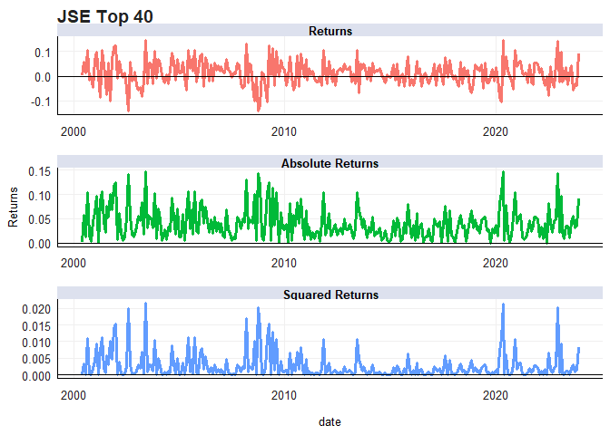

# Purpose

I investigate linkages between the S&P 500 and the JSE Top 40 through
stratification and various GARCH modeling techniques.

This README serves as guide to the code for my Financial Econometrics
essay. The full essay can be found under “22550801_FMX_essay.pdf”. The
code used to create the formal document can found under the “Texevier/”
folder. All functions used in the code below are stored in separate
scripts stored in the “code/” folder. The purpose of this README is
therefore to document the code that was used in creating the output used
in the essay. As such all analysis is left to the formal document.

I first load all the required packages and functions from the scripts.

``` r
rm(list = ls()) # Clean your environment:
gc() # garbage collection - It can be useful to call gc after a large object has been removed, as this may prompt R to return memory to the operating system.
library(tidyverse)
library(readxl)
library(fmxdat)
library(tseries)
library(knitr)
library(MTS)
library(zoo)
library(ggthemes)
library(rmgarch)
library(rugarch)
library(mgarchBEKK)

list.files('code/', full.names = T, recursive = T) %>% .[grepl('.R', .)] %>% as.list() %>% walk(~source(.))
```

# Loading and Wrangling

This section deals with loading and wrangling the data into a usable
format. I then plot the returns, absolute returns and squared returns
using the “returns_plotter” function.

``` r
global_indices <- readRDS("data/Global_Indices.rds")
local_indices <- readRDS("data/LCL_Indices.rds")
USDZAR <- readRDS("data/USDZAR.rds")

#S&P 500
SP <- global_indices %>% 
    filter(Tickers == "SPXT") %>% 
    select(c(date, Returns)) %>% 
    rename(SP500 = Returns)

#JSE Top 40
lcl_index <- "J200" # I create this variable so the choice of SA index can easily be changed
JSE <- local_indices %>% 
    filter(Tickers == lcl_index) %>% 
    select(c(date, Returns)) %>% 
    rename(JSE40 = Returns)

joinedDF <- left_join(SP, JSE, by = 'date')

firstdate <- joinedDF %>%  slice(1) %>% pull(date)

#ZAR/USD exchange rate
ZARUSD <- USDZAR %>% 
    select(c(date, value)) %>% 
    filter(date >= firstdate) %>% 
    mutate(yearmonth = format(ymd(date), "%Y-%m")) %>% 
    group_by(yearmonth) %>% 
    mutate(ZARUSD = dplyr::last(value)/dplyr::first(value) - 1) %>% 
    filter(date == dplyr::last(date)) %>% 
    ungroup() %>% 
    slice(-1) %>% 
    select(c(date, ZARUSD))

joinedDF <- left_join(ZARUSD, joinedDF, by = 'date') 
joinedDF <- joinedDF[c(1,3,4,2)]

#Plot the returns
returns_plotter(joinedDF, c("S&P 500", "JSE Top 40", "USD/ZAR"))
```

    ## $`S&P 500`


    ## 
    ## $`JSE Top 40`



    ## 
    ## $`USD/ZAR`


# Stratification

This analysis will first focus on seeing whether the JSE experience
higher volatility when the S&P and the rand experiences higher
volatility. This follows the practical. First returns are winsorized to
limit the impact of outliers. The “analyze_volatility_periods” then
calculates the high and low volatility periods and subsequent ratios for
each series.

``` r
#Winsorizing the data to reduce influence of extreme returns
Idxs <- joinedDF %>% 
    gather(Index, Returns, -date) %>% 
    mutate(Year = format(date, "%Y")) %>% 
    group_by(Index) %>% 
    mutate(Top = quantile(Returns, 0.99), Bot = quantile(Returns, 0.01)) %>% 
    mutate(Returns = ifelse(Returns > Top, Top, 
                         ifelse(Returns < Bot, Bot, Returns))) %>% 
    ungroup()

#The analyze_volatility_periods function returns a table for stratification analysis
# of high and low volatility periods for a specific series

results_SP <- analyze_volatility_periods(joinedDF, "SP500", Idxs)
kableExtra::kable(results_SP$HighVol, caption = "S&P 500")
```

<table>
<caption>
S&P 500
</caption>
<thead>
<tr>
<th style="text-align:left;">
Index
</th>
<th style="text-align:right;">
SD
</th>
<th style="text-align:right;">
Full_SD
</th>
<th style="text-align:left;">
Period
</th>
<th style="text-align:right;">
Ratio
</th>
</tr>
</thead>
<tbody>
<tr>
<td style="text-align:left;">
JSE40
</td>
<td style="text-align:right;">
0.2299961
</td>
<td style="text-align:right;">
0.1700823
</td>
<td style="text-align:left;">
High_Vol SP500
</td>
<td style="text-align:right;">
1.352263
</td>
</tr>
<tr>
<td style="text-align:left;">
ZARUSD
</td>
<td style="text-align:right;">
0.1874059
</td>
<td style="text-align:right;">
0.1595920
</td>
<td style="text-align:left;">
High_Vol SP500
</td>
<td style="text-align:right;">
1.174282
</td>
</tr>
</tbody>
</table>

``` r
kableExtra::kable(results_SP$LowVol, caption = "S&P 500")
```

<table>
<caption>
S&P 500
</caption>
<thead>
<tr>
<th style="text-align:left;">
Index
</th>
<th style="text-align:right;">
SD
</th>
<th style="text-align:right;">
Full_SD
</th>
<th style="text-align:left;">
Period
</th>
<th style="text-align:right;">
Ratio
</th>
</tr>
</thead>
<tbody>
<tr>
<td style="text-align:left;">
ZARUSD
</td>
<td style="text-align:right;">
0.1643987
</td>
<td style="text-align:right;">
0.1595920
</td>
<td style="text-align:left;">
Low_Vol SP500
</td>
<td style="text-align:right;">
1.0301190
</td>
</tr>
<tr>
<td style="text-align:left;">
JSE40
</td>
<td style="text-align:right;">
0.1385775
</td>
<td style="text-align:right;">
0.1700823
</td>
<td style="text-align:left;">
Low_Vol SP500
</td>
<td style="text-align:right;">
0.8147671
</td>
</tr>
</tbody>
</table>

``` r
results_rand <- analyze_volatility_periods(joinedDF, "ZARUSD", Idxs)
kableExtra::kable(results_rand$HighVol, caption = "ZAR/USD")
```

<table>
<caption>
ZAR/USD
</caption>
<thead>
<tr>
<th style="text-align:left;">
Index
</th>
<th style="text-align:right;">
SD
</th>
<th style="text-align:right;">
Full_SD
</th>
<th style="text-align:left;">
Period
</th>
<th style="text-align:right;">
Ratio
</th>
</tr>
</thead>
<tbody>
<tr>
<td style="text-align:left;">
JSE40
</td>
<td style="text-align:right;">
0.1761936
</td>
<td style="text-align:right;">
0.1700823
</td>
<td style="text-align:left;">
High_Vol ZARUSD
</td>
<td style="text-align:right;">
1.035931
</td>
</tr>
<tr>
<td style="text-align:left;">
SP500
</td>
<td style="text-align:right;">
0.1596056
</td>
<td style="text-align:right;">
0.1493840
</td>
<td style="text-align:left;">
High_Vol ZARUSD
</td>
<td style="text-align:right;">
1.068425
</td>
</tr>
</tbody>
</table>

``` r
kableExtra::kable(results_rand$LowVol, caption = "ZAR/USD")
```

<table>
<caption>
ZAR/USD
</caption>
<thead>
<tr>
<th style="text-align:left;">
Index
</th>
<th style="text-align:right;">
SD
</th>
<th style="text-align:right;">
Full_SD
</th>
<th style="text-align:left;">
Period
</th>
<th style="text-align:right;">
Ratio
</th>
</tr>
</thead>
<tbody>
<tr>
<td style="text-align:left;">
JSE40
</td>
<td style="text-align:right;">
0.1337340
</td>
<td style="text-align:right;">
0.1700823
</td>
<td style="text-align:left;">
Low_Vol ZARUSD
</td>
<td style="text-align:right;">
0.7862896
</td>
</tr>
<tr>
<td style="text-align:left;">
SP500
</td>
<td style="text-align:right;">
0.1313495
</td>
<td style="text-align:right;">
0.1493840
</td>
<td style="text-align:left;">
Low_Vol ZARUSD
</td>
<td style="text-align:right;">
0.8792745
</td>
</tr>
</tbody>
</table>

``` r
results_JSE <- analyze_volatility_periods(joinedDF, "JSE40", Idxs)
kableExtra::kable(results_JSE$HighVol, caption = "JSE Top 40")
```

<table>
<caption>
JSE Top 40
</caption>
<thead>
<tr>
<th style="text-align:left;">
Index
</th>
<th style="text-align:right;">
SD
</th>
<th style="text-align:right;">
Full_SD
</th>
<th style="text-align:left;">
Period
</th>
<th style="text-align:right;">
Ratio
</th>
</tr>
</thead>
<tbody>
<tr>
<td style="text-align:left;">
SP500
</td>
<td style="text-align:right;">
0.2047917
</td>
<td style="text-align:right;">
0.149384
</td>
<td style="text-align:left;">
High_Vol JSE40
</td>
<td style="text-align:right;">
1.370908
</td>
</tr>
<tr>
<td style="text-align:left;">
ZARUSD
</td>
<td style="text-align:right;">
0.1859849
</td>
<td style="text-align:right;">
0.159592
</td>
<td style="text-align:left;">
High_Vol JSE40
</td>
<td style="text-align:right;">
1.165378
</td>
</tr>
</tbody>
</table>

``` r
kableExtra::kable(results_JSE$LowVol, caption = "JSE Top 40")
```

<table>
<caption>
JSE Top 40
</caption>
<thead>
<tr>
<th style="text-align:left;">
Index
</th>
<th style="text-align:right;">
SD
</th>
<th style="text-align:right;">
Full_SD
</th>
<th style="text-align:left;">
Period
</th>
<th style="text-align:right;">
Ratio
</th>
</tr>
</thead>
<tbody>
<tr>
<td style="text-align:left;">
ZARUSD
</td>
<td style="text-align:right;">
0.1305594
</td>
<td style="text-align:right;">
0.159592
</td>
<td style="text-align:left;">
Low_Vol JSE40
</td>
<td style="text-align:right;">
0.8180826
</td>
</tr>
<tr>
<td style="text-align:left;">
SP500
</td>
<td style="text-align:right;">
0.1042043
</td>
<td style="text-align:right;">
0.149384
</td>
<td style="text-align:left;">
Low_Vol JSE40
</td>
<td style="text-align:right;">
0.6975598
</td>
</tr>
</tbody>
</table>

# ARCH Tests

To test for ARCH effects I create a function that fits a simple AR(1) to
each return series. I then run Ljung-Box tests on the residuals of each
of those models. This is handled by the “ljungbox_tests” function. The
null of “No ARCH effects” is rejected for the S&P 500 and the JSE Top
40. I then run multivariate Portmanteau tests to incorporate all series,
simultaneously.

``` r
ret_df <- joinedDF %>% 
    select(c(-date))

#Call function that loops through every series and runs Ljung-Box tests
arch_results_lb <- ljungbox_tests(ret_df) 
kable(arch_results_lb, caption = "Ljung-Box Tests")
```

<table>
<caption>
Ljung-Box Tests
</caption>
<thead>
<tr>
<th style="text-align:left;">
Series
</th>
<th style="text-align:right;">
TestStatistic
</th>
<th style="text-align:right;">
PValue
</th>
<th style="text-align:right;">
LagOrder
</th>
</tr>
</thead>
<tbody>
<tr>
<td style="text-align:left;">
SP500
</td>
<td style="text-align:right;">
66.52538
</td>
<td style="text-align:right;">
0.0000000
</td>
<td style="text-align:right;">
12
</td>
</tr>
<tr>
<td style="text-align:left;">
JSE40
</td>
<td style="text-align:right;">
65.74928
</td>
<td style="text-align:right;">
0.0000000
</td>
<td style="text-align:right;">
12
</td>
</tr>
<tr>
<td style="text-align:left;">
ZARUSD
</td>
<td style="text-align:right;">
16.09037
</td>
<td style="text-align:right;">
0.1378091
</td>
<td style="text-align:right;">
12
</td>
</tr>
</tbody>
</table>

``` r
#MV Portmanteau tests
arch_results_march <- MarchTest(ret_df)
```

    ## Q(m) of squared series(LM test):  
    ## Test statistic:  81.32437  p-value:  2.760014e-13 
    ## Rank-based Test:  
    ## Test statistic:  92.52711  p-value:  1.665335e-15 
    ## Q_k(m) of squared series:  
    ## Test statistic:  165.2131  p-value:  2.329855e-06 
    ## Robust Test(5%) :  144.048  p-value:  0.000259541

# GARCH modelling

## Univariate GARCH models

I will now fit various univariate GARCH models to determine the best
specification. The “uniGarchFitter” function loops through the dataframe
and fits 3 different GARCH models to each series. After each type of
model is fitted, selection criteria for that model is calculated and
added to a dataframe that will later be outputted.

``` r
garch_df <- joinedDF %>% 
    select(c(SP500, JSE40, ZARUSD)) %>% 
    rename(SP = SP500,
           JSE = JSE40,
           ZARUSD = ZARUSD) 

uGarch_tables <- uniGarchFitter(garch_df)

kableExtra::kable(uGarch_tables$SP, caption = "S&P 500")
```

<table>
<caption>
S&P 500
</caption>
<thead>
<tr>
<th style="text-align:left;">
Model
</th>
<th style="text-align:right;">
Akaike
</th>
<th style="text-align:right;">
Bayes
</th>
<th style="text-align:right;">
Shibata
</th>
<th style="text-align:right;">
HannanQuinn
</th>
</tr>
</thead>
<tbody>
<tr>
<td style="text-align:left;">
sGARCH
</td>
<td style="text-align:right;">
-3.543804
</td>
<td style="text-align:right;">
-3.479397
</td>
<td style="text-align:right;">
-3.544414
</td>
<td style="text-align:right;">
-3.517979
</td>
</tr>
<tr>
<td style="text-align:left;">
gjrGARCH
</td>
<td style="text-align:right;">
-3.598589
</td>
<td style="text-align:right;">
-3.521301
</td>
<td style="text-align:right;">
-3.599464
</td>
<td style="text-align:right;">
-3.567599
</td>
</tr>
<tr>
<td style="text-align:left;">
apARCH
</td>
<td style="text-align:right;">
-3.591571
</td>
<td style="text-align:right;">
-3.501401
</td>
<td style="text-align:right;">
-3.592755
</td>
<td style="text-align:right;">
-3.555416
</td>
</tr>
</tbody>
</table>

``` r
kableExtra::kable(uGarch_tables$JSE, caption = "JSE Top 40")
```

<table>
<caption>
JSE Top 40
</caption>
<thead>
<tr>
<th style="text-align:left;">
Model
</th>
<th style="text-align:right;">
Akaike
</th>
<th style="text-align:right;">
Bayes
</th>
<th style="text-align:right;">
Shibata
</th>
<th style="text-align:right;">
HannanQuinn
</th>
</tr>
</thead>
<tbody>
<tr>
<td style="text-align:left;">
sGARCH
</td>
<td style="text-align:right;">
-3.200662
</td>
<td style="text-align:right;">
-3.136255
</td>
<td style="text-align:right;">
-3.201272
</td>
<td style="text-align:right;">
-3.174837
</td>
</tr>
<tr>
<td style="text-align:left;">
gjrGARCH
</td>
<td style="text-align:right;">
-3.262467
</td>
<td style="text-align:right;">
-3.185178
</td>
<td style="text-align:right;">
-3.263341
</td>
<td style="text-align:right;">
-3.231476
</td>
</tr>
<tr>
<td style="text-align:left;">
apARCH
</td>
<td style="text-align:right;">
-3.256765
</td>
<td style="text-align:right;">
-3.166595
</td>
<td style="text-align:right;">
-3.257950
</td>
<td style="text-align:right;">
-3.220610
</td>
</tr>
</tbody>
</table>

``` r
kableExtra::kable(uGarch_tables$ZARUSD, caption = "ZAR/USD")
```

<table>
<caption>
ZAR/USD
</caption>
<thead>
<tr>
<th style="text-align:left;">
Model
</th>
<th style="text-align:right;">
Akaike
</th>
<th style="text-align:right;">
Bayes
</th>
<th style="text-align:right;">
Shibata
</th>
<th style="text-align:right;">
HannanQuinn
</th>
</tr>
</thead>
<tbody>
<tr>
<td style="text-align:left;">
sGARCH
</td>
<td style="text-align:right;">
-3.257713
</td>
<td style="text-align:right;">
-3.193306
</td>
<td style="text-align:right;">
-3.258323
</td>
<td style="text-align:right;">
-3.231888
</td>
</tr>
<tr>
<td style="text-align:left;">
gjrGARCH
</td>
<td style="text-align:right;">
-3.250676
</td>
<td style="text-align:right;">
-3.173387
</td>
<td style="text-align:right;">
-3.251550
</td>
<td style="text-align:right;">
-3.219686
</td>
</tr>
<tr>
<td style="text-align:left;">
apARCH
</td>
<td style="text-align:right;">
-3.196725
</td>
<td style="text-align:right;">
-3.106555
</td>
<td style="text-align:right;">
-3.197910
</td>
<td style="text-align:right;">
-3.160570
</td>
</tr>
</tbody>
</table>

For the S&P 500 and JSE Top 40 the gjrGARCH performs best. For the Rand
it is the sGARCH. I therefore select the gjrGARCH as my univariate
specification.

## Multivariate GARCH

``` r
#Create and xts object for GARCH modeling to come
garch_xts <- joinedDF %>% 
    rename(SP = SP500,
           JSE = JSE40,
           ZARUSD = ZARUSD) %>% 
    tbl2xts::tbl_xts()
```

### DCC

I first fit an Engle type DCC and then a DCC model based on the
univariate gjrGARCH specification. The results are practically the same.
For each model I extract the time varying correlation and run it through
the “renamingdcc” function to spimplify plotting and analysis later on.

``` r
#Fit DCC
DCCpre <- dccPre(garch_xts, include.mean = T, p = 0)
```

    ## Sample mean of the returns:  0.006646004 0.01205957 0.0040101 
    ## Component:  1 
    ## Estimates:  0.000103 0.236377 0.729762 
    ## se.coef  :  6.6e-05 0.067012 0.073488 
    ## t-value  :  1.553856 3.527388 9.93041 
    ## Component:  2 
    ## Estimates:  0.000268 0.201884 0.701823 
    ## se.coef  :  0.000177 0.089231 0.125333 
    ## t-value  :  1.515427 2.262495 5.599679 
    ## Component:  3 
    ## Estimates:  0.001245 0.373383 0.135037 
    ## se.coef  :  0.000303 0.129176 0.135575 
    ## t-value  :  4.109286 2.890494 0.996026

``` r
StdRes <- DCCpre$sresi

DCC <- dccFit(StdRes, type="Engle")
```

    ## Estimates:  0.885281 0.03319359 20 
    ## st.errors:  0.07263721 0.02059145 9.307685 
    ## t-values:   12.18771 1.612008 2.148762

``` r
Rhot <- DCC$rho.t

ReturnSeries = garch_xts
DCC.TV.Cor = Rhot


DCC$estimates
```

    ## [1]  0.88528102  0.03319359 20.00000000

``` r
#Rename TV correlations
Rhot <- 
  renamingdcc(ReturnSeries = garch_xts, DCC.TV.Cor = Rhot)


#Plot correlations for the JSE
dcc_JSE <- ggplot(Rhot %>% filter(grepl("JSE_", Pairs ), !grepl("_JSE", Pairs)) ) + 
    geom_line(aes(x = date, y = Rho, colour = Pairs), linewidth = 1) + 
    
    annotate("rect", xmin = as.Date("2007-06-22"), xmax = as.Date("2009-06-23"),
    ymin = -Inf, ymax = Inf, fill = "red", alpha = 0.4)+
    annotate("rect", xmin = as.Date("2020-03-15"), xmax = as.Date("2022-06-20"),
    ymin = -Inf, ymax = Inf, fill = "blue", alpha = 0.4)+
    
    theme_fmx()+
    ggtitle("Dynamic Conditional Correlations: JSE")+
    scale_x_date(date_breaks = "4 years", date_labels = "%Y")

finplot(dcc_JSE)
```


``` r
#Spec and fit DCC model based on gjrGARCH specification
uspec <- ugarchspec(variance.model = list(model = "gjrGARCH", garchOrder = c(1, 1)), 
                    mean.model = list(armaOrder = c(1, 0), include.mean = TRUE), 
                    distribution.model = "sstd")

multi_univ_garch_spec <- multispec(replicate(ncol(garch_xts), uspec))

spec.dcc = dccspec(multi_univ_garch_spec, dccOrder = c(1, 1), 
                   distribution = "mvnorm", 
                   lag.criterion = c("AIC", "HQ", "SC", "FPE")[1], 
                   model = c("DCC", "aDCC")[1])

cl = makePSOCKcluster(10) #Enable for speed

multf = multifit(multi_univ_garch_spec, garch_xts, cluster = cl)

fit.dcc = dccfit(spec.dcc, data = garch_xts, solver = "solnp", 
    cluster = cl, fit.control = list(eval.se = FALSE), fit = multf)

#Extract and rename TV correlations
RcovList <- rcov(fit.dcc)  # This is now a list of the monthly covariances of our DCC model series.
covmat = matrix(RcovList, nrow(garch_xts), ncol(garch_xts) * ncol(garch_xts), 
    byrow = TRUE)
#mc1 = MCHdiag(garch_xts, covmat)

dcc.time.var.cor <- rcor(fit.dcc)

dcc.time.var.cor <- aperm(dcc.time.var.cor, c(3, 2, 1))
dim(dcc.time.var.cor) <- c(nrow(dcc.time.var.cor), ncol(dcc.time.var.cor)^2)

dcc.time.var.cor <- renamingdcc(ReturnSeries = garch_xts, DCC.TV.Cor = dcc.time.var.cor)

#Plot correlations for JSE
dcc_JSE_gjr <- ggplot(dcc.time.var.cor %>% dplyr::filter(grepl("JSE_", Pairs ), 
                                                         !grepl("_JSE", Pairs))) + 
    geom_line(aes(x = date, y = Rho, colour = Pairs), linewidth = 1) + 
    
    annotate("rect", xmin = as.Date("2007-06-22"), xmax = as.Date("2009-06-23"),
    ymin = -Inf, ymax = Inf, fill = "red", alpha = 0.4)+
    annotate("rect", xmin = as.Date("2020-03-15"), xmax = as.Date("2022-06-20"),
    ymin = -Inf, ymax = Inf, fill = "blue", alpha = 0.4)+
    
    theme_fmx()+
    ggtitle("Dynamic Conditional Correlations: JSE")+
    scale_x_date(date_breaks = "4 years", date_labels = "%Y")

finplot(dcc_JSE_gjr)
```


Next, to test for changes in correlation during the GFC and Covid-19, I
run the following code.

``` r
# This code extracts the correlations for the GFC and COvid-19.
# It then calculates the difference between the first and max, and the first and
# last correlation.

## GFC calculations
gfc_df <- dcc.time.var.cor %>% 
    filter(Pairs == "JSE_SP") %>% 
    filter(date >= as.Date("2007-06-22") & date <= as.Date("2009-06-23"))

first_gfc <- gfc_df %>% slice(1) %>% pull(Rho)
last_gfc <- gfc_df %>% slice(n()) %>% pull(Rho)
max_gfc <- max(gfc_df$Rho)

max_gfc - first_gfc
```

    ## [1] 0.07505941

``` r
last_gfc - first_gfc
```

    ## [1] 0.06254073

``` r
## Covid-19 calculations
covid_df <- dcc.time.var.cor %>% 
    filter(Pairs == "JSE_SP") %>% 
    filter(date >= as.Date("2020-02-15") & date <= as.Date("2021-12-01"))

first_covid <- covid_df %>% slice(1) %>% pull(Rho)
last_covid <- covid_df %>% slice(n()) %>% pull(Rho)
max_covid <- max(covid_df$Rho)

max_covid - first_covid
```

    ## [1] 0.1145516

``` r
last_covid - first_covid
```

    ## [1] 0.01038957

### Go-Garch

Next I fit a Go-Garch model. This model is based on the same gjrGARCH
specification as the DCC model.

``` r
#Spec GO-GARCH
spec.go <- gogarchspec(multi_univ_garch_spec, 
                       distribution.model = 'mvnorm', # or manig.
                       ica = 'fastica') # Note: we use the fastICA
cl <- makePSOCKcluster(10)
multf <- multifit(multi_univ_garch_spec, garch_xts, cluster = cl)

#Fit GO-GARCH
fit.gogarch <- gogarchfit(spec.go, 
                      data = garch_xts, 
                      solver = 'hybrid', 
                      cluster = cl, 
                      gfun = 'tanh', 
                      maxiter1 = 40000, 
                      epsilon = 1e-08, 
                      rseed = 100)

print(fit.gogarch)
```

    ## 
    ## *------------------------------*
    ## *        GO-GARCH Fit          *
    ## *------------------------------*
    ## 
    ## Mean Model       : CONSTANT
    ## GARCH Model      : sGARCH
    ## Distribution : mvnorm
    ## ICA Method       : fastica
    ## No. Factors      : 3
    ## No. Periods      : 283
    ## Log-Likelihood   : 1507.03
    ## ------------------------------------
    ## 
    ## U (rotation matrix) : 
    ## 
    ##          [,1]   [,2]   [,3]
    ## [1,] -0.00845 -0.127 0.9919
    ## [2,] -0.33702  0.934 0.1168
    ## [3,]  0.94146  0.333 0.0507
    ## 
    ## A (mixing matrix) : 
    ## 
    ##          [,1]   [,2]    [,3]
    ## [1,]  0.01882 0.0131 -0.0380
    ## [2,] -0.02098 0.0233 -0.0391
    ## [3,] -0.00599 0.0358  0.0320

``` r
# Extracting time-varying conditional correlations
gog.time.var.cor <- rcor(fit.gogarch)
gog.time.var.cor <- aperm(gog.time.var.cor,c(3,2,1))
dim(gog.time.var.cor) <- c(nrow(gog.time.var.cor), ncol(gog.time.var.cor)^2)
# Rename TV correlations
gog.time.var.cor <-
renamingdcc(ReturnSeries = garch_xts, DCC.TV.Cor = gog.time.var.cor)

#Plot correlations for JSE
gog_JSE_gjr <- ggplot(gog.time.var.cor %>% dplyr::filter(grepl("JSE_", Pairs ), 
                                                         !grepl("_JSE", Pairs))) + 
    geom_line(aes(x = date, y = Rho, colour = Pairs), linewidth = 1) + 
    
    annotate("rect", xmin = as.Date("2007-06-22"), xmax = as.Date("2009-06-23"),
    ymin = -Inf, ymax = Inf, fill = "red", alpha = 0.4)+
    annotate("rect", xmin = as.Date("2020-03-15"), xmax = as.Date("2022-06-20"),
    ymin = -Inf, ymax = Inf, fill = "blue", alpha = 0.4)+
    
    theme_fmx()+
    ggtitle("Dynamic Conditional Correlations: JSE")+
    scale_x_date(date_breaks = "4 years", date_labels = "%Y")

finplot(gog_JSE_gjr)
```


The code that follows once again calculates differences during the GFC
and Covid-19

``` r
# This code extracts the correlations for the GFC and COvid-19.
# It then calculates the difference between the first and max, and the first and
# last correlation.

## GFC calculations
gfc_df <- gog.time.var.cor %>% 
    filter(Pairs == "JSE_SP") %>% 
    filter(date >= as.Date("2007-06-22") & date <= as.Date("2009-06-23"))

first_gfc <- gfc_df %>% slice(1) %>% pull(Rho)
last_gfc <- gfc_df %>% slice(n()) %>% pull(Rho)
max_gfc <- max(gfc_df$Rho)

max_gfc - first_gfc
```

    ## [1] 0.361618

``` r
last_gfc - first_gfc
```

    ## [1] 0.2189339

``` r
## Covid-19 calculations
covid_df <- gog.time.var.cor %>% 
    filter(Pairs == "JSE_SP") %>% 
    filter(date >= as.Date("2020-02-15") & date <= as.Date("2021-12-01"))

first_covid <- covid_df %>% slice(1) %>% pull(Rho)
last_covid <- covid_df %>% slice(n()) %>% pull(Rho)
max_covid <- max(covid_df$Rho)

max_covid - first_covid
```

    ## [1] 0.2781306

``` r
last_covid - first_covid
```

    ## [1] -0.01110067

### BEKK-GARCH

Lastly I fit a BEKK-GARCH model to estimate the spillover effects
between the 3 return series.

``` r
#Convert dataframe to matrix as the BEKK function requires a matric
garch_df <- joinedDF %>% 
    select(c(SP500, JSE40, ZARUSD)) %>% 
    rename(SP = SP500,
           JSE = JSE40,
           ZARUSD = ZARUSD) 

garch_matrix <- as.matrix(garch_df)

#Estimate the BEKK-GARCH model
estimated <- mgarchBEKK::BEKK(garch_matrix)
```

The default output of the fitting the BEKK model is parameter matrices.
This is quite convenient, however for the sake of the write up a table
will work better. I therefore write a simple matrix extractor function
that takes each element in a matrix and puts it in a dataframe. I then
create such a dataframe for each parameter matrix and bind them by rows.

``` r
extract_matrix_elements <- function(matrix, prefix) {
  # Initialize an empty dataframe with appropriate column names
  result_df <- data.frame(Position = character(), 
                          Value = numeric(), 
                          stringsAsFactors = FALSE)

  # Loop through each element of the matrix
  for (row in 1:nrow(matrix)) {
    for (col in 1:ncol(matrix)) {
      # Create a position string (e.g., "(2,1)")
        #The prefix arguments serves as a way to identify which matrix 
        #the coefficient is from
      position <- paste(prefix ,"(", row, ",", col, ")", sep = "") 
      
      # Append the position and value to the dataframe
      result_df <- rbind(result_df, data.frame(Position = position, 
                                               Value = matrix[row, col]))
    }
  }
  
  return(result_df)
}

#Extract constants
garch_constants <- extract_matrix_elements(estimated$est.params[[1]], "C")
garch_constants_se <- extract_matrix_elements(estimated$asy.se.coef[[1]], "C")

garch_result_df <- left_join(garch_constants, garch_constants_se, by="Position") %>% 
    filter(Value.x != 0) #Filter out zeros, since the matrix is triangular

#Extract ARCH effects
garch_amat <- extract_matrix_elements(estimated$est.params[[2]], "A")
garch_amat_se <- extract_matrix_elements(estimated$asy.se.coef[[2]], "A")

amat_joined <- left_join(garch_amat, garch_amat_se, by="Position")

#Extract GARCH effects
garch_bmat <- extract_matrix_elements(estimated$est.params[[3]], "B")
garch_bmat_se <- extract_matrix_elements(estimated$asy.se.coef[[3]], "B")

bmat_joined <- left_join(garch_bmat, garch_bmat_se, by="Position")

garch_result_df <- rbind(garch_result_df, amat_joined)
garch_result_df <- rbind(garch_result_df, bmat_joined)
colnames(garch_result_df) <- c(" ", "Coefficient", "Std. Error")

# Add stars indicating significant levels
garch_results_final <- garch_result_df %>% 
    mutate(TStat = Coefficient / `Std. Error`,
           Significance = ifelse(abs(TStat) > 2.576, "***", 
                                 ifelse(abs(TStat) > 1.96, "**", 
                                        ifelse(abs(TStat) > 1.645, "*", ""))))

#Output entire table
kable(garch_results_final, caption = "BEKK-GARCH results")
```

<table>
<caption>
BEKK-GARCH results
</caption>
<thead>
<tr>
<th style="text-align:left;">
</th>
<th style="text-align:right;">
Coefficient
</th>
<th style="text-align:right;">
Std. Error
</th>
<th style="text-align:right;">
TStat
</th>
<th style="text-align:left;">
Significance
</th>
</tr>
</thead>
<tbody>
<tr>
<td style="text-align:left;">
C(1,1)
</td>
<td style="text-align:right;">
0.0380978
</td>
<td style="text-align:right;">
0.0062151
</td>
<td style="text-align:right;">
6.1298280
</td>
<td style="text-align:left;">
\*\*\*
</td>
</tr>
<tr>
<td style="text-align:left;">
C(1,2)
</td>
<td style="text-align:right;">
0.0182193
</td>
<td style="text-align:right;">
0.0149529
</td>
<td style="text-align:right;">
1.2184484
</td>
<td style="text-align:left;">
</td>
</tr>
<tr>
<td style="text-align:left;">
C(1,3)
</td>
<td style="text-align:right;">
-0.0142889
</td>
<td style="text-align:right;">
0.0049230
</td>
<td style="text-align:right;">
-2.9024971
</td>
<td style="text-align:left;">
\*\*\*
</td>
</tr>
<tr>
<td style="text-align:left;">
C(2,2)
</td>
<td style="text-align:right;">
0.0150211
</td>
<td style="text-align:right;">
0.0200417
</td>
<td style="text-align:right;">
0.7494933
</td>
<td style="text-align:left;">
</td>
</tr>
<tr>
<td style="text-align:left;">
C(2,3)
</td>
<td style="text-align:right;">
-0.0091460
</td>
<td style="text-align:right;">
0.0174655
</td>
<td style="text-align:right;">
-0.5236604
</td>
<td style="text-align:left;">
</td>
</tr>
<tr>
<td style="text-align:left;">
C(3,3)
</td>
<td style="text-align:right;">
0.0391408
</td>
<td style="text-align:right;">
0.0070223
</td>
<td style="text-align:right;">
5.5738171
</td>
<td style="text-align:left;">
\*\*\*
</td>
</tr>
<tr>
<td style="text-align:left;">
A(1,1)
</td>
<td style="text-align:right;">
0.0539006
</td>
<td style="text-align:right;">
0.1957541
</td>
<td style="text-align:right;">
0.2753486
</td>
<td style="text-align:left;">
</td>
</tr>
<tr>
<td style="text-align:left;">
A(1,2)
</td>
<td style="text-align:right;">
-0.3133579
</td>
<td style="text-align:right;">
0.2961480
</td>
<td style="text-align:right;">
-1.0581127
</td>
<td style="text-align:left;">
</td>
</tr>
<tr>
<td style="text-align:left;">
A(1,3)
</td>
<td style="text-align:right;">
-0.3343832
</td>
<td style="text-align:right;">
0.1862873
</td>
<td style="text-align:right;">
-1.7949869
</td>
<td style="text-align:left;">

-   </td>
    </tr>
    <tr>
    <td style="text-align:left;">
    A(2,1)
    </td>
    <td style="text-align:right;">
    -0.3058476
    </td>
    <td style="text-align:right;">
    0.1514115
    </td>
    <td style="text-align:right;">
    -2.0199757
    </td>
    <td style="text-align:left;">
    \*\*
    </td>
    </tr>
    <tr>
    <td style="text-align:left;">
    A(2,2)
    </td>
    <td style="text-align:right;">
    0.1427509
    </td>
    <td style="text-align:right;">
    0.1914826
    </td>
    <td style="text-align:right;">
    0.7455035
    </td>
    <td style="text-align:left;">
    </td>
    </tr>
    <tr>
    <td style="text-align:left;">
    A(2,3)
    </td>
    <td style="text-align:right;">
    0.5941598
    </td>
    <td style="text-align:right;">
    0.1497553
    </td>
    <td style="text-align:right;">
    3.9675387
    </td>
    <td style="text-align:left;">
    \*\*\*
    </td>
    </tr>
    <tr>
    <td style="text-align:left;">
    A(3,1)
    </td>
    <td style="text-align:right;">
    0.2485180
    </td>
    <td style="text-align:right;">
    0.0894545
    </td>
    <td style="text-align:right;">
    2.7781504
    </td>
    <td style="text-align:left;">
    \*\*\*
    </td>
    </tr>
    <tr>
    <td style="text-align:left;">
    A(3,2)
    </td>
    <td style="text-align:right;">
    0.2343271
    </td>
    <td style="text-align:right;">
    0.1199156
    </td>
    <td style="text-align:right;">
    1.9541008
    </td>
    <td style="text-align:left;">

    -   </td>
        </tr>
        <tr>
        <td style="text-align:left;">
        A(3,3)
        </td>
        <td style="text-align:right;">
        -0.0621894
        </td>
        <td style="text-align:right;">
        0.1223480
        </td>
        <td style="text-align:right;">
        -0.5082993
        </td>
        <td style="text-align:left;">
        </td>
        </tr>
        <tr>
        <td style="text-align:left;">
        B(1,1)
        </td>
        <td style="text-align:right;">
        -0.0013453
        </td>
        <td style="text-align:right;">
        0.1913787
        </td>
        <td style="text-align:right;">
        -0.0070297
        </td>
        <td style="text-align:left;">
        </td>
        </tr>
        <tr>
        <td style="text-align:left;">
        B(1,2)
        </td>
        <td style="text-align:right;">
        -0.0215581
        </td>
        <td style="text-align:right;">
        0.5822370
        </td>
        <td style="text-align:right;">
        -0.0370263
        </td>
        <td style="text-align:left;">
        </td>
        </tr>
        <tr>
        <td style="text-align:left;">
        B(1,3)
        </td>
        <td style="text-align:right;">
        -0.0150115
        </td>
        <td style="text-align:right;">
        0.0757566
        </td>
        <td style="text-align:right;">
        -0.1981539
        </td>
        <td style="text-align:left;">
        </td>
        </tr>
        <tr>
        <td style="text-align:left;">
        B(2,1)
        </td>
        <td style="text-align:right;">
        0.0322619
        </td>
        <td style="text-align:right;">
        0.1296931
        </td>
        <td style="text-align:right;">
        0.2487554
        </td>
        <td style="text-align:left;">
        </td>
        </tr>
        <tr>
        <td style="text-align:left;">
        B(2,2)
        </td>
        <td style="text-align:right;">
        0.0813841
        </td>
        <td style="text-align:right;">
        0.3297444
        </td>
        <td style="text-align:right;">
        0.2468097
        </td>
        <td style="text-align:left;">
        </td>
        </tr>
        <tr>
        <td style="text-align:left;">
        B(2,3)
        </td>
        <td style="text-align:right;">
        -0.0049306
        </td>
        <td style="text-align:right;">
        0.0646160
        </td>
        <td style="text-align:right;">
        -0.0763063
        </td>
        <td style="text-align:left;">
        </td>
        </tr>
        <tr>
        <td style="text-align:left;">
        B(3,1)
        </td>
        <td style="text-align:right;">
        -0.2760136
        </td>
        <td style="text-align:right;">
        0.3255124
        </td>
        <td style="text-align:right;">
        -0.8479357
        </td>
        <td style="text-align:left;">
        </td>
        </tr>
        <tr>
        <td style="text-align:left;">
        B(3,2)
        </td>
        <td style="text-align:right;">
        -0.8576035
        </td>
        <td style="text-align:right;">
        0.2673825
        </td>
        <td style="text-align:right;">
        -3.2074032
        </td>
        <td style="text-align:left;">
        \*\*\*
        </td>
        </tr>
        <tr>
        <td style="text-align:left;">
        B(3,3)
        </td>
        <td style="text-align:right;">
        -0.0661716
        </td>
        <td style="text-align:right;">
        0.1847699
        </td>
        <td style="text-align:right;">
        -0.3581295
        </td>
        <td style="text-align:left;">
        </td>
        </tr>
        </tbody>
        </table>

What you are left with is a table with all the parameters in the
BEKK-GARCH model and their significance levels. The output for the
significance levels appear strange here but work fine within the formal
document.

``` r
## You can uncomment this code if you prefer the results to be represented in
##  matrices

# BEKK_estimates <- estimated$est.params
# names(BEKK_estimates) <- c("Constants", "ARCH estimates", "GARCH estimates")
# 
# BEKK_se <- estimated$asy.se.coef
# names(BEKK_se) <- c("Constants' standard errors", "ARCH standard errors", 
#                     "GARCH standard errors")
# 
# 
# matrix_rename <- function(matrix, headers){
#     colnames(matrix) <- headers
#     rownames(matrix) <- headers
#     return(matrix)
# }
# 
# renamed_BEKK_estimates <- lapply(BEKK_estimates, matrix_rename, 
#                                  headers = c("SP", "JSE", "Rand"))
# renamed_BEKK_se <- lapply(BEKK_se, matrix_rename, 
#                           headers = c("SP", "JSE", "Rand"))
# 
# 
# kable(renamed_BEKK_estimates$Constants,
#       caption = 'Constants')
# kable(renamed_BEKK_se$`Constants' standard errors`,
#       caption = "Constants' standard errors")
# 
# kable(renamed_BEKK_estimates$`ARCH estimates`,
#       caption = "ARCH Estimates")
# kable(renamed_BEKK_se$`ARCH standard errors`,
#       caption = "ARCH standard errors")
# 
# kable(renamed_BEKK_estimates$`GARCH estimates`,
#       caption = "GARCH Estimates")
# kable(renamed_BEKK_se$`GARCH standard errors`,
#       caption = "GARCH standard errors")
```
